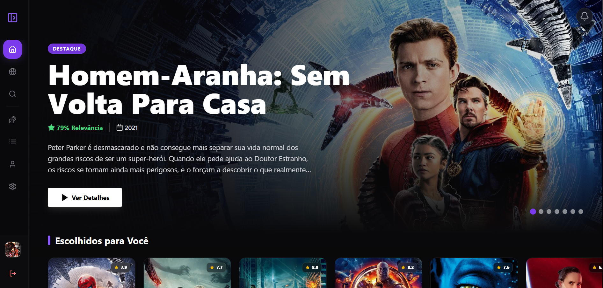
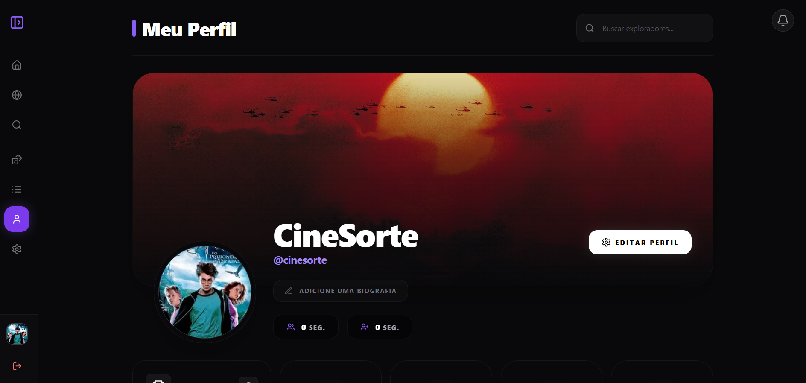

<div align="center">
  

  # CineSorte

  **Your movies, your people, your next story.**

  CineSorte is a social entertainment platform where people discover movies and TV shows, organize what they watch, share opinions, connect with other viewers, and enjoy synchronized watch parties.

  [Live application](https://cinesorte.vercel.app/) · [Portfolio](https://brianlucca.vercel.app/)
</div>

## The experience

CineSorte goes beyond title discovery. It combines a personalized movie and TV catalog with profiles, social interactions, private messaging, shared collections, viewing history, and collaborative sessions. The experience is designed around a simple goal: make choosing, watching, and talking about entertainment feel connected.



## What CineSorte offers today

- **Personalized discovery** — Trending titles, current releases, recommendations, trailers, anime, animations, and curated rows powered by TMDB data.
- **Movie roulette** — A filter-driven random picker for moments when deciding what to watch is harder than watching it.
- **Rich media pages** — Details for movies, shows, seasons, episodes, and people, including cast, crew, providers, images, trailers, and related recommendations.
- **Lists and collections** — Custom lists that can be maintained, shared with the community, viewed publicly, and cloned by other users.
- **Reviews and activity** — Ratings, reviews, comments, likes, mentions, and a watch diary that build each user's viewing history.
- **Social profiles** — Custom avatars, backgrounds, biographies, statistics, followers, following, public activity, reviews, and compatibility between users.
- **Community feed** — Global, following, and shared-collection feeds for discovering opinions, people, and lists.
- **Direct and group messaging** — Private conversations, group chats, media cards, unread states, blocking controls, and live updates.
- **Watch parties** — Public, private, and following-based rooms with participants, chat, queues, room controls, YouTube playback, local video, and screen sharing.
- **Continue watching** — Viewing progress synchronized with the user's account through the CineSorte Sync browser extension flow.
- **Account and safety controls** — Email verification, Google authentication, password and email management, connected-device controls, user blocking, notifications, privacy terms, and support tickets.

## Profiles built around taste

Profiles turn viewing activity into a personal cinema identity. Users can customize how they appear, follow other viewers, revisit their diary and reviews, and explore the people and titles shaping their experience.



## Product structure

The frontend follows a feature-oriented architecture. Each domain owns its pages, components, hooks, services, and data, while shared UI, authentication, API access, caching, and session utilities remain reusable across the application.

```text
src/
├── app/                 Application shell, layouts, and routing
├── features/            Product domains and their local logic
│   ├── auth/            Registration, login, and account verification
│   ├── dashboard/       Personalized home experience
│   ├── feed/            Community activity and shared posts
│   ├── lists/           Personal and public collections
│   ├── media/           Movies, shows, seasons, episodes, and reviews
│   ├── messages/        Direct and group conversations
│   ├── people/          Cast and crew profiles
│   ├── profile/         User identity, diary, reviews, and statistics
│   ├── roulette/        Randomized discovery experience
│   ├── settings/        Account, security, appearance, and support
│   └── watch-party/     Rooms, players, queues, chat, and sharing
└── shared/              Reusable API, context, hooks, UI, and utilities
```

## Technology

- React 18 and React Router
- Vite
- Tailwind CSS
- Framer Motion and GSAP
- React Three Fiber and Three.js
- Axios with credential-based API sessions and response caching
- Server-Sent Events for live notifications, messages, and room updates
- TMDB-backed movie and television data
- Cloudflare Turnstile integration
- Vercel deployment and serverless sharing metadata

## Current direction

CineSorte is evolving as a complete social layer for entertainment: discovery is the entry point, but personal taste, community, conversation, and shared viewing are the core of the product.

<div align="center">
  Built by <a href="https://brianlucca.vercel.app/">Brian Lucca</a>
</div>
